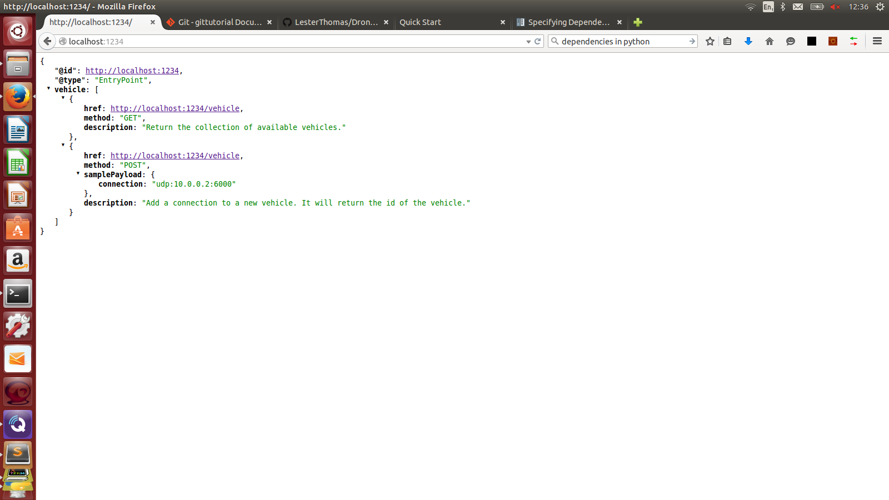
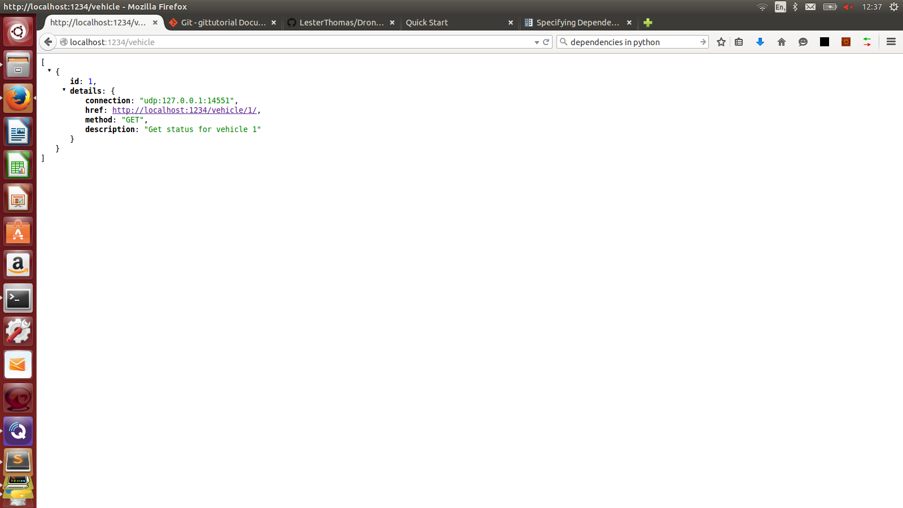
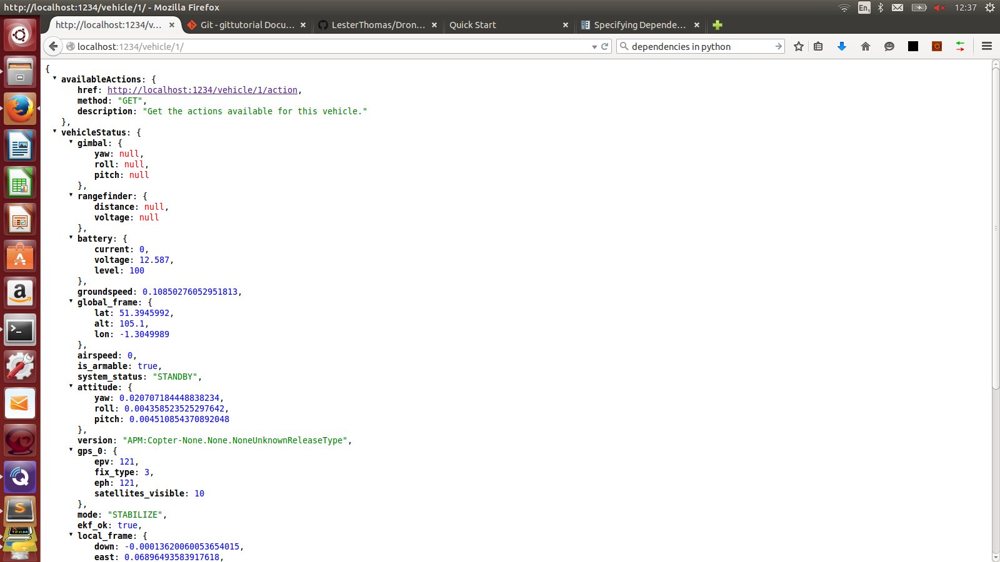
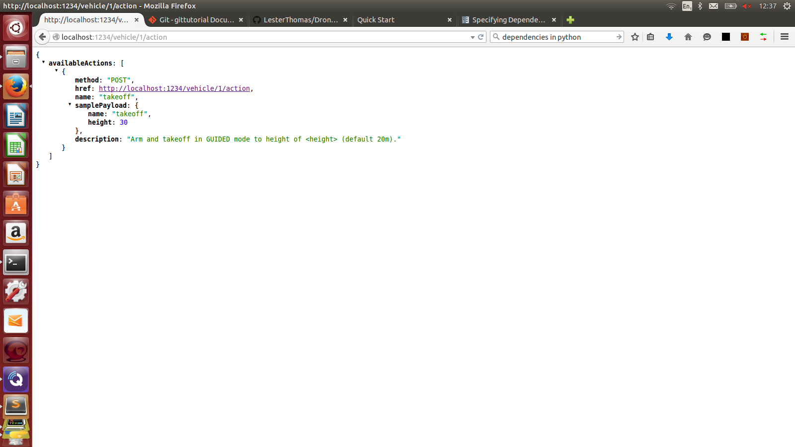

# DroneRESTAPI

This project provides a simple hypermedia REST API on top of the Python DroneKit SDK (http://python.dronekit.io/). It consists of a set of micro-services running in docker containers deployed in kubernetes.

## Installation

Ensure your kubectl is correctly configured and pointing to a kubernetes cluster, then type the following command
```kubectl apply -f https://raw.githubusercontent.com/LesterThomas/DroneRESTAPI/master/kubernetes_all```

Thats it! It may take a couple of minutes foe all the docker images to download and build. Once deployment is complete, see instructions below for using the API and provided Web console.


## Using API

Using a browser or REST API Client (I recommend Postman), browse to the root of the service exposed by kubernetes (this is created by the kubernetes Ingress. If this is working correctly, you should get a `API Key Error` returned in the response. You need to create an account which will automatically create an API key before the service will work fully.


The returned payload is the EntryPoint (or homepage) of the API and shows the APIs available. The following images capture a sample of browsing through the API.







#Build instructions

## Building Docker image

The Dockerfile builds on top of the baselineDocker file (that creates the `lesterthomas/sitlbase:1.0` image). To re-build the Docker image execute the command:

```docker build -t lesterthomas/dronesim:1.5 .```

## Python module documentation

The python ```pdoc``` documentation is at:

[droneAPIMain](http://htmlpreview.github.io/?https://github.com/LesterThomas/DroneRESTAPI/blob/master/droneAPIMain.m.html): The main module that sets-up the API server.

[droneAPIUtils](http://htmlpreview.github.io/?https://github.com/LesterThomas/DroneRESTAPI/blob/master/droneAPIUtils.m.html): Utility functions that manage global data structures and Redis database.

Modules for each end-point:


- /vehicle : [droneAPIVehicleIndex](http://htmlpreview.github.io/?https://github.com/LesterThomas/DroneRESTAPI/blob/master/droneAPIVehicleIndex.m.html) 
	- /vehicle/(.*) : [droneAPIVehicleStatus](http://htmlpreview.github.io/?https://github.com/LesterThomas/DroneRESTAPI/blob/master/droneAPIVehicleStatus.m.html) 
		- /vehicle/(.*)/action : [droneAPIAction](http://htmlpreview.github.io/?https://github.com/LesterThomas/DroneRESTAPI/blob/master/droneAPIAction.m.html)  
		- /vehicle/(.*)/homeLocation : [droneAPIHomeLocation](http://htmlpreview.github.io/?https://github.com/LesterThomas/DroneRESTAPI/blob/master/droneAPIHomeLocation.m.html)  
		- /vehicle/(.*)/mission : [droneAPIMission](http://htmlpreview.github.io/?https://github.com/LesterThomas/DroneRESTAPI/blob/master/droneAPIMission.m.html) 
		- /vehicle/(.*)/authorizedZone : [droneAPIAuthorizedZone](http://htmlpreview.github.io/?https://github.com/LesterThomas/DroneRESTAPI/blob/master/droneAPIAuthorizedZone.m.html) 
		- /vehicle/(.*)/simulator : [droneAPISimulator](http://htmlpreview.github.io/?https://github.com/LesterThomas/DroneRESTAPI/blob/master/droneAPISimulator.m.html) 
- /admin : [droneAPIAdmin](http://htmlpreview.github.io/?https://github.com/LesterThomas/DroneRESTAPI/blob/master/droneAPIAdmin.m.html) 


